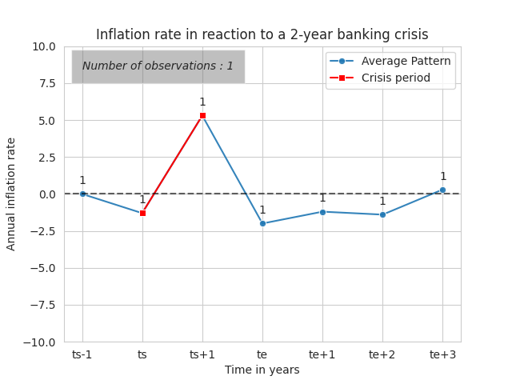

# Banking Crisis and Inflation Cycles

## Data Modelling of Financial Crisis Recovery

This repository aims to provide empirical evidence to the paper *Information Cycles and Depression in a Stochastic Money-in-Utility Model* from Horii, Ryo from the Institute of Social and Economic Research at Osaka University.

We aim to estimate the average response of macroeconomic variables to **banking crisis** of different durations, as well as the average pattern of a **recovery period** to a banking crisis.

## Two Methods for the Data Extraction

### 1. First Method

- **Main idea:** We keep all the data of **inflation** and **output gap** in **banking crisis / recovery periods** but stop the series if an **excluded year** occurs.

- We extract the data of the inflation rate and output gap during each banking crisis but we stop the extraction if an excluded year occurs. In this case, the series is cut until the excluded year, but we keep the series in our analysis.

- In the extraction of the data during **recovery periods**, we take into account the data of the recovery of a banking crisis even if an excluded year happened during one year of the banking crisis period. We will stop the series only if an excluded year occurs during the recovery.

### 2. Second Method

- **Main idea:** We want to use only **clean data** so we choose to remove from the analysis all the banking crises that contain an excluded year.

- We extract the data of the inflation rate and output gap during each banking crisis but if an excluded year occurs, we consider it as **"contaminated data"** and exclude it from the analysis. In the first part of plotting the average reaction of the inflation rate and output gap according to each crisis length, if an excluded year occurs before arriving at 9 years after this crisis, we drop the series.

- In the study of the dynamics during crisis and recovery periods, we follow the following procedure:
  - In the extraction of the data during **recovery periods**, we don't take into account the data of the recovery of a banking crisis if an excluded year happened during one year of the banking crisis period. We, however, extract data of recovery periods until another banking crisis occurs or until an excluded year occurs (and in this case, we keep the serie).
  - In the extraction of the data during **crisis periods**, we remove the series that contains excluded years.
